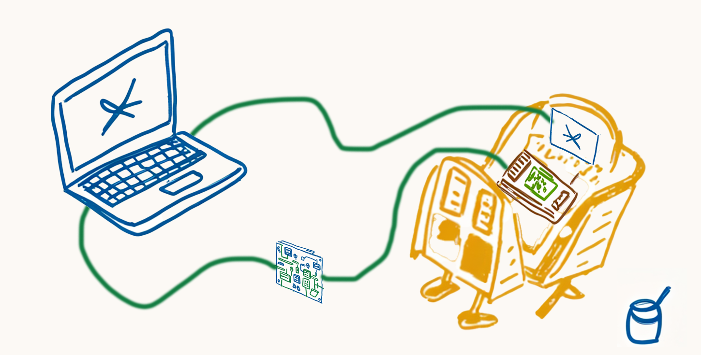

# Tangible Interfaces Submarine Design Project

## Introduction

Welcome to the "AquaNova Submarine" Student Design Project for Steve Turbek's "Tangible Interfaces" Industrial Design class at Pratt Institute! This collaborative challenge sits at the intersection of industrial design, user experience, and physical computing. Throughout this project, you'll work in teams to create an immersive submarine piloting experience that combines digital interfaces with physical controls.

## Demo Link (in early development)

[Web game experience - not yet working!](https://steveturbek.github.io/Tangible-Interfaces-Submarine-Design-Project)


## The Design Challenge

You are a design team tasked with creating the next generation of personal submersibles. Your submersible needs to navigate complex underwater environments while providing an intuitive interface for pilots of varying experience levels.

Success in this project will require balancing aesthetic appeal with functional clarity. Your instruments must be visually consistent with your cockpit design while providing clear information. Your physical controls must feel natural while providing the precision needed for delicate maneuvers.

You'll work in teams of three, with two teams designing seated cockpits and two teams designing prone cockpits. At the end of the project, visiting guests will test each design to determine which provides the most intuitive user experience, their average time to complete the mission will be a factor in rating the design of the team.

Your mission:

1. Research and identify target market
1. Create brand for sub line
1. Design the visual styling of your submersible cockpit
1. Create on-screen digital user experience instruments that effectively communicate critical vehicle information
1. Build physical control set (buttons, joysticks, etc.) to drive the submarine that provide an intuitive piloting experience
1. User Start Guide as needed
1. Test with real people
1. Write up and present design, process, and findings

**Are you ready to dive in?**

## Learning Objectives

By completing this project, you will:

- Apply industrial design principles to vehicle interface design
- Translate abstract data into meaningful visual instruments
- Create physical control systems that map intuitively to digital actions
- Test and iterate based on user feedback
- Collaborate effectively with a design team
- Present and defend design decisions

## The Gameplay Experience

Your submersible will navigate through an underwater maze of coral reefs. The pilot must reach an underwater base before running out of oxygen or electricity. The gameplay emphasizes careful resource management and precise navigation through challenging 3D environments.

## Physical Mockup Concept

To make this project possible for a design student, we have a technical framework to build from. This GitHub Project builds a web app 'game' with on-screen UX instruments that can be customized. The project contains simplish recipes to connect hardware controls to this game. Very little electronics or programming is expected. Examples are provided to learn from.

The student will design and fabricate th items in diagram below

1. A cockpit design prototype (orange), either beautiful or rough, from wood or cardboard
1. An innovative and beautiful physical control set (red/green)
1. The controls will send signals to the Micro:bit board (center)
1. The board will send a USB message to the student laptop (blue)
1. The laptop drive an external monitor(s) embedded in cockpit design prototype (blue rectangle)



## Submarine Description

The student will have the ability to design the submarine. Here are the technical design constraints. A clever team can write code to change these, but they are responsible for these customizations.

- Left and Right (Port and Starboard) [Underwater thrusters](https://en.wikipedia.org/wiki/Underwater_thruster)

## Submarine Inspiration

- https://robbreport.com/motors/marine/gallery/personal-submersibles-exploration-1234848269/unknown-32/

## GitHub Project Structure

The repository is organized as follows:

```
├── index.html          # Game page **Do not edit**
├── js/                 # JavaScript files **Do not edit**
│   ├── game.js         # Core game mechanics
│   ├── controls.js     # Input handling
│   ├── rendering.js    # 3D scene rendering
│   └── instruments.js  # Cockpit instrument displays
├── artwork/             # Images, CSS, and other assets to customize the game **Edit only these files**
├── assets/             # Images, CSS, and other assets to customize the game **Do not edit only these files**
└── examples/           # Example code
```

## Student Development process

1. "Fork" this project
2. Replace the files in artwork folder
3. Publish your fork to github pages
4. Test and play game

## Technical Requirements

- **Browser**: Chrome (latest version)
- **Hardware**: Micro:bit v2 for physical controls configuration
- **UX design**: Photoshop, illustrator, AI tools for coding
- **Programming**: Basic JavaScript and CSS (examples provided)
- **Publishing**: GitHub Pages for hosting (provided)

## Game Features

### Environment

- First-person 3D underwater environment
- Randomly generated levels (with seed options for competitive play)
- 10 learning levels of increasing complexity

### Game Mechanics

- Oxygen management (countdown timer)
- Electric power management (reduced by engine usage)
- Navigation challenges (tight passageways, 3D maze)

### Cockpit Instruments

Students will design and implement SVG-based instruments displaying:

- Oxygen level 0-100%
- Battery level 0-100%
- Speed
- max speed
- pitch (up / down)
- Yaw (left/right)
- Sonar distance to target
- Depth
- Compass direction 0-359°

### Physical Controls

Using the Micro:bit v2 as a bridge to the computer, students will implement at a minimum:

- Game start/selection controls
- "Blow tanks" emergency button
- Forward/backward propulsion (digital and analog)
- Pitch and yaw steering (digital and analog)

## Getting Started

### Prerequisites

- A GitHub account
- Chrome browser
- Micro:bit v2 with USB cable
- Basic text editor or IDE
- various electronics parts

### Installation

1. Fork this repository
1. Enable GitHub Pages in your repository settings
1. Connect your Micro:bit v2 via USB
1. Open the game URL in Chrome

### Development Workflow

(in your fork)

1. Modify the SVG elements in the HTML/CSS for cockpit design
1. Update the configuration in `config.js` for control scaling
1. Test your implementation using keyboard controls
1. Integrate Micro:bit controls using the provided examples

## Testing Your Design

The final class session will involve user testing with visiting guests. They will test each team's design to determine which interface is most intuitive and effective.

## Future Enhancements (Phase 2)

- Damage mechanics (wall collisions, shark attacks)
- Use of lights to see better (with strategic consequences, uses electricity, attracts sharks)
- Different vehicle designs with tradeoffs
- Supplies (oxygen)
- Supply grabber arm
- Beacon placement system

## References

- https://edges.ideo.com/posts/figproxy
- https://microflow.vercel.app/
- https://support.microbit.org/support/solutions/articles/19000071689-can-i-control-my-pc-or-simulate-a-keyboard-and-mouse-
-
