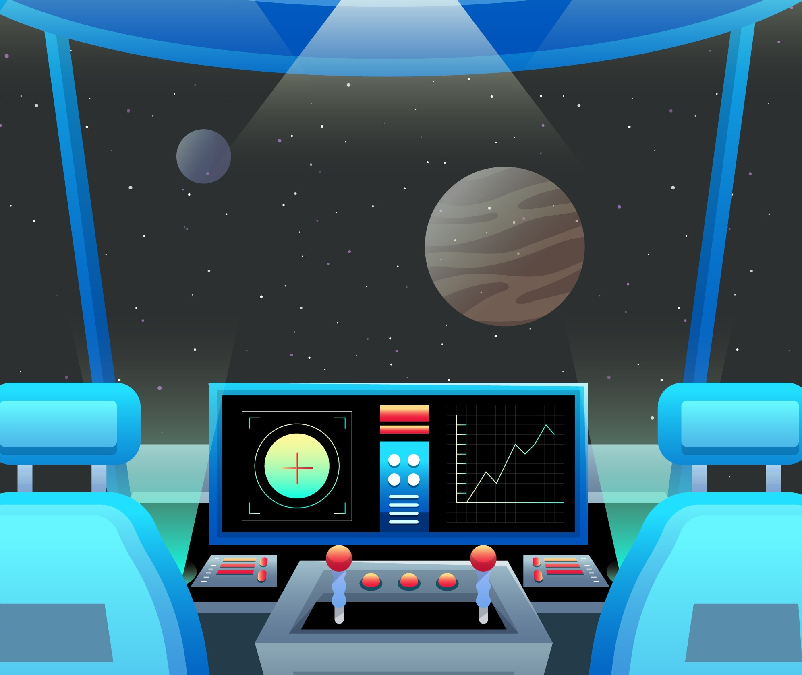

# Tangible Interfaces Submarine Design Project

## Introduction

Welcome to the Submarine Design Project for [Steve Turbek's "Tangible Interfaces" Industrial Design class](https://turbek.com/articles/tangible-interfaces-class.html) at Pratt Institute! This collaborative challenge sits at the intersection of industrial design, user experience, and physical computing. Throughout this project, you'll work in teams to create an immersive submarine piloting experience that combines digital interfaces with physical controls.



## The Design Challenge

You are a design team tasked by "AquaNova Submarine" with creating the next generation of personal submersibles. Your submersible needs to navigate complex underwater environments while providing an intuitive interface for pilots of varying experience levels.

Success in this project will require balancing aesthetic appeal with functional clarity. Your instruments must be visually consistent with your cockpit design while providing clear information. Your physical controls must feel natural while providing the precision needed for delicate maneuvers.

You'll work in teams of three to cover all the tasks. At the end of the project, visiting guests will test each design to determine which provides the most intuitive user experience, their average time to complete the mission will be a factor in rating the design of the team.

Your mission:

1. Research and identify target market
1. Create brand for sub line
1. Design the visual styling of your submersible cockpit
1. Create on-screen digital user experience instruments that effectively communicate critical vehicle information
1. Build physical control set (buttons, joysticks, etc.) to drive the submarine that provide an intuitive piloting experience
1. User Start Guide as needed
1. Test with real people
1. Write up and present design, process, and findings

**Are you ready to dive in?**

## The Gameplay Experience

Your submersible will navigate through an underwater maze of coral reefs. The pilot must reach an underwater base before running out of oxygen or electricity. The gameplay emphasizes careful resource management and precise navigation through challenging 3D environments.

## Demo Link (in development)

[Web game experience](https://steveturbek.github.io/Tangible-Interfaces-Submarine-Design-Project)

Note the game is intended to be played with custom hardware controls, but can be steered with keyboard for development. See below for tips.

## Physical Prototype

To make this project possible for a design student, we have a technical framework to build from. This GitHub Project builds a web app 'game' with on-screen UX instruments that can be customized. The project contains basic recipes to connect hardware controls to this game. Very little electronics or programming is expected. Examples are provided to learn from.

The student will design and fabricate

1. A cockpit design prototype (orange), either beautiful or rough, from wood or cardboard
1. An innovative and beautiful physical control set (red/green)
1. The controls will send signals to the Micro:bit board (center)
1. The board will send a USB message to the student laptop (blue)
1. The laptop drive an external monitor(s) embedded in cockpit design prototype (blue rectangle)

The four teams will each design a cockpit for a pilot who is:

- Seated upright
- Prone (like a swimmer)
- Recumbent
- Standing/leaning

## Submarine Description

The student will have the ability to design the submarine. Here are the technical design constraints. A clever team can write code to change these, but they are responsible for these customizations.

- Left (Port) and Right(Starboard) [Underwater thrusters](https://en.wikipedia.org/wiki/Underwater_thruster) : These face forward and are centered front to back and top to bottom. They operate like tank treads, if both drive forward, the vehicle goes forward; both back: back; one front the other back, vehicle turns. One operating, the other not, the vehicle goes at half speed and turns in the opposite direction.
- [Rudder](https://en.wikipedia.org/wiki/Rudder): turns vehicle left and right, proportional to vehicle speed
- [Elevators](<https://en.wikipedia.org/wiki/Elevator_(aeronautics)>): points vehicle up and down, proportional to vehicle speed
- Aft thrusters; Small thrusters that point vehicle up and down; very slow, but works when not in motion

The submarine is an idealized, simplified vehicle to keep the project fun!

## Submarines for Inspiration

- https://www.uboatworx.com/custom2
- https://tritonsubs.com/subs/
- https://en.wikipedia.org/wiki/DeepFlight_Super_Falcon
- https://www.seamagine.com/small-submarines-models.html
- https://www.thejetshark.com/
- https://robbreport.com/motors/marine/gallery/personal-submersibles-exploration-1234848269/unknown-32/

## Submarine Technical Reference

- [Pressure Vessel for Human Occupancy](https://en.wikipedia.org/wiki/Pressure_vessel_for_human_occupancy)
- [PVHO-1 - Safety Standard for Pressure Vessels for Human Occupancy](https://www.asme.org/codes-standards/find-codes-standards/safety-standard-for-pressure-vessels-for-human-occupancy/2023/pdf)
- [DNV Manned submersibles classification ](https://www.dnv.com/services/manned-submersibles-1102/)

## Learning Objectives

By completing this project, you will:

- Apply industrial design principles to vehicle interface design
- Translate abstract data into meaningful visual instruments
- Create physical control systems that map intuitively to digital actions
- Test and iterate based on user feedback
- Collaborate effectively with a design team
- Present and defend design decisions

## Design Evaluation Criteria

These criteria balance the practical requirements (can users actually pilot the submarine effectively?) with the design education goals of the course (research, process, aesthetics, and user-centered thinking).

- Innovation
- Aesthetics and Desirability
- Integration of parts into a whole
- Teamwork
- Presentation and communication

### 1. Usability & Intuitive Control Mapping

- How naturally do the physical controls map to submarine movements?
- Can users quickly understand and operate the interface without extensive training?
- Are critical functions easily accessible during navigation tasks?
- Does the control layout follow established conventions or create new, logical patterns?

### 2. Mission Performance & User Testing Results

- Average completion time for the underwater navigation mission
- Success rate of test users reaching the target destination
- Oxygen and battery resource management effectiveness
- Error rates and recovery time when users make mistakes

### 3. Information Design & Visual Clarity

- Effectiveness of the instrument panel in communicating critical data (oxygen, battery, depth, compass, etc.)
- Visual hierarchy and readability under simulated underwater conditions
- Integration between digital instruments and overall cockpit aesthetic
- Appropriate use of color, typography, and iconography for the submarine context

### 4. Physical Design Integration & Ergonomics

- How well the physical controls integrate with the cockpit design (seated vs. prone configurations)
- Comfort and reach considerations for extended use
- Build quality and durability of the physical prototype
- Aesthetic coherence between the brand identity, cockpit styling, and control interfaces

### 5. Design Process & Research Documentation

- Quality of target market research and user personas
- Evidence of iterative design and testing cycles
- Documentation of design decisions and problem-solving approaches
- Brand development and its consistent application across all designs

## Game Overview

### Current State

The game is functional, can be navigated with keyboard keys or with a microbit. See Github Issues for ideas.

### Game Mechanics

- Oxygen management (countdown timer)
- Electric power management (reduced by engine usage)
- Navigation challenges (tight passageways, 3D maze)

### Cockpit Instruments

Students will design and implement SVG-based instruments displaying:

- Oxygen level 0-100%
- Battery level 0-100%
- Speed
- Pitch (up / down)
- Yaw (left/right)
- Sonar distance to target
- Depth
- Compass direction 0-359°

### Physical Controls

Using the Micro:bit v2 as a bridge to the computer, students will implement at a minimum:

- Game start/selection controls
- "Blow tanks" emergency button
- Forward/backward propulsion (digital and analog)
- Pitch and yaw steering (digital and analog)

## Getting Started

### Technical Requirements

- **Browser**: Chrome (latest version)
- **Hardware**: Micro:bit v2 for physical controls configuration
- **UX design**: Photoshop, illustrator, AI tools for coding
- **Programming**: Basic JavaScript and CSS (examples provided)
- **Publishing**: GitHub Pages for hosting (provided)

### Prerequisites

- A GitHub account
- Chrome browser
- Micro:bit v2 with USB cable
- Basic text editor or IDE
- various electronics parts

### Installation

1. Fork this repository
1. Enable GitHub Pages in your repository settings
1. Download for local development (not required, but faster)
1. Connect your Micro:bit v2 via USB
1. Open your GitHub Pages game URL in Chrome

### Development Workflow

(in your fork)

1. Modify the SVG elements in the HTML/CSS for cockpit design
1. Test your implementation using keyboard controls
1. Integrate Micro:bit controls using the provided examples

## GitHub Project Structure

The repository is organized as follows:

```
├── index.html          # Game page **Do not edit**
├── js/                 # JavaScript files **Do not edit**
│   ├── game.js                 # Core game mechanics
│   ├── controls.js             # Input handling
│   ├── rendering.js            # 3D scene rendering
│   ├── hardware-controls.js    # to interpret the data coming from the microbit to send to the sub controls
│   ├── instruments.js          # Cockpit instrument displays
│   └── microbit-serial.js      # Receive and interpret messages from microbit board
├── artwork/            # Images, CSS, and other assets to customize the game **Edit only these files**
├── assets/             # Images, CSS, and other assets to customize the game **Do not edit only these files**
└── examples/           # Example code
```

### Submarine Control Guide - Left Hand Keyboard Layout

Note the game is intended to be played with custom hardware controls, but can be steered with keyboard for development.

### ⌨️ 🕹️ Key Controls

| Key   | Function                | Effect                                   |
| ----- | ----------------------- | ---------------------------------------- |
| `↑`   | Elevator Up             | Pitches the submarine downward (descend) |
| `↓`   | Elevator Down           | Pitches the submarine upward (ascend)    |
| `←`   | Rudder Left             | Turns the submarine to the left          |
| `→`   | Rudder Right            | Turns the submarine to the right         |
| `a`   | Left Thruster Increase  | Increases power to the left thruster     |
| `z`   | Left Thruster Decrease  | Decreases power to the left thruster     |
| `s`   | Right Thruster Increase | Increases power to the right thruster    |
| `x`   | Right Thruster Decrease | Decreases power to the right thruster    |
| `TAB` | Sub-Data-Overlay Toggle | Toggles the submarine data overlay       |
| `ESC` | Emergency Brake         | Slows it down                            |

### 📊 Less Common Controls

| Key | Function              | Effect                                                                          |
| --- | --------------------- | ------------------------------------------------------------------------------- |
| `P` | Aft Thruster Increase | Increases power to the aft (rear) thruster which slowly points vehicle upward   |
| `L` | Aft Thruster Decrease | Decreases power to the aft (rear) thruster which slowly points vehicle downward |
| `B` | Emergency Surface     | Activates emergency surfacing procedure                                         |

### 💡 Tips for New Pilots

1. **Start slow**: Begin with small adjustments to get a feel for the submarine's response.
2. **Watch your depth**
3. **Turn gradually**
4. **Monitor your systems**:
