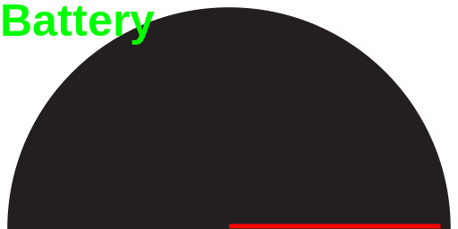

# Tangible Interfaces Submarine Design Project

{:style="max-width: 100%;"}

<div class="toc-wrapper" markdown="1">

## Contents
{: .no_toc}

* TOC
{:toc}

</div>

## Introduction

This Submarine Design Project is part of [Steve Turbek's "Tangible Interfaces" Industrial Design class](https://turbek.com/Tangible-Interfaces/) at Pratt Institute. In this project, you'll work in teams to create an immersive submarine piloting experience that combines industrial design, user interface design, and physical computing.

<a href="https://github.com/steveturbek/Tangible-Interfaces-Submarine-Design-Project/" target="new">Open Source on GitHub.com</a>

## Game Setup

- The [Submarine Simulator](https://turbek.com/Tangible-Interfaces-Submarine-Design-Project/game.html) is a web based game that simulates piloting a personal submarine. The player aims to collect a jewel and return to the surface before they run out of oxygen and battery.
- The game has two windows: the submarine's front window and an instrument dashboard. In the final presentation, the instruments are on a laptop monitor, with a projector for the outside view.
- The students design and code the working instruments dashboard, needed for safely steering the sub.
- Students will design and prototype hardware controls to direct the submarine. A Microbit board can be programmed to interpret sensor inputs and send to the game via USB cable.
- The vehicle interior and exterior design are integrated into a unified concept with steering and instruments.

Your submersible will navigate through an underwater maze of coral reefs. The pilot must reach an underwater base before running out of oxygen or electricity. The gameplay emphasizes careful resource management and precise navigation through challenging 3D environments.

[Submarine Simulator](https://turbek.com/Tangible-Interfaces-Submarine-Design-Project/game.html)

Note the game is intended to be played with custom hardware controls, but can be steered with USB gamepad or keyboard for development.

**Video of game play**

<video autoplay muted loop playsinline  width="100%" alt="video of game play">
   <source src="artwork/game-video-clip.mp4" type="video/mp4" />
</video>

[Longer video of front view of simulator](artwork/game-video.mp4)

**Video of dashboard instruments**

<video autoplay muted loop playsinline  width="100%" alt="video of dashboard instrument SVGs in action">
   <source src="artwork/dashboard.mp4" type="video/mp4" />
</video>

## The Design Challenge

You are a design team tasked by "AquaNova Submarine" with creating the next generation of personal submersibles for beginner pilots.

Success in this project will require balancing aesthetic appeal with functional clarity. Your instruments must be visually consistent with your cockpit design while providing clear information. Your physical controls must feel natural while providing the precision needed for delicate maneuvers.

You'll work in teams of three/four to cover all the tasks. At the end of the project, visiting guests will test each design to determine which provides the most intuitive user experience, their average time to complete the mission will be a factor in rating the design of the team.

To make this project possible for a design student, a technical framework has been made. The project contains basic recipes to connect hardware controls to this game. Very little electronics or programming is expected. Examples are provided to learn from.

**We want the control experience to be THE major selling point of this sub - what innovative and cool experience can you design?**

## Your mission:

1. Research and identify a **target market**
1. Create the **brand** for your sub
1. Research and **design the vehicle** exterior
1. A **cockpit interior design** prototype, either beautiful or rough, from wood or cardboard, with a pilot position (Seated, Prone, Recumbent, or Standing)
1. An innovative and beautiful **physical controls** (buttons, joysticks, etc.) to drive the submarine with an intuitive piloting experience
1. **Microbit code** to interpret the controls and send to the laptop.
1. Design submersible **dashboard user experience** for the instruments to communicate critical vehicle information
1. Write and Design a **User Start Guide** (Printed, PDF, or interactive)
1. **Test** with real people
1. Write up and present design, process, and findings

## Research and Reference

### Submarines for Inspiration

- [Triton Subs](https://tritonsubs.com/subs/)
- [U-boat worx](https://www.uboatworx.com/custom2)
<!-- - https://en.wikipedia.org/wiki/DeepFlight_Super_Falcon -->
- [Seamagine subs](https://www.seamagine.com/small-submarines-models.html)
- [Jet Shark](https://www.thejetshark.com/)
- [Robb Report on personal submersibles](https://robbreport.com/motors/marine/gallery/personal-submersibles-exploration-1234848269/)
- [User instructions to flush a toilet underwater](https://firehead.net/2009/08/submarine-toilet-flushing-instructions/). Funny only [if it happens to someone else](https://en.wikipedia.org/wiki/German_submarine_U-1206#Fate)!

### Videos of Submarines, with a focus on their controls

#### Triton

- [TRITON 660 AVA intro video](https://youtu.be/dR12ckJUCU8)
- [Triton control panels shown](https://youtu.be/SAGwGN_V4nk)
- [Triton controls shown](https://youtu.be/xcJ-XV-aP7Q)
- [Making of deep submergence vehicle](https://youtu.be/pb5j9oeZCm0)
- [NOVA PBS episode](https://www.pbs.org/wgbh/nova/video/building-stuff-reach-it/) - Triton section can be found between these timings: 14:50 - 27.26.

#### U-Boat Worx

- [U Boat-Worx Controls](https://youtu.be/eqIBfny8q70)
- [Nemo vehicle](https://youtu.be/AvE27dh70qM)
- [Super Sub vehicle](https://www.youtube.com/watch?v=VdqN9sgdrtU)
- [Controls demo](https://youtu.be/JPVJ8ZV5em8)
- [Mexico Expedition C-Explorer 5 - Whale Shark Diving](https://www.youtube.com/watch?v=fpxmoK-bL9c)

#### Seamagine

- [Pilot training](https://www.youtube.com/watch?v=_N5IolEUQtk)

### (Fictional) Movies for inspiration

- [Last Breath (2025)](https://www.imdb.com/title/tt14403504) - Submarine Divers in trouble
- [The Abyss (1989)](https://www.imdb.com/title/tt0096754/) - James Cameron's sci-fi thriller about a deep-sea oil rig crew encountering mysterious underwater phenomena
- [Das Boot (1981)](https://www.imdb.com/title/tt0082096/) - German WWII epic following a U-boat crew's harrowing Atlantic patrol
- [The Hunt for Red October (1990)](https://www.imdb.com/title/tt0099810/) - Cold War thriller about a Soviet submarine captain's defection attempt
- [Gravity (2013)](https://www.imdb.com/title/tt1454468) - In space, but key scene involves learning old user controls

### Submarine Technical Reference

- [Pressure Vessel for Human Occupancy](https://en.wikipedia.org/wiki/Pressure_vessel_for_human_occupancy)
- [PVHO-1 - Safety Standard for Pressure Vessels for Human Occupancy](https://www.asme.org/codes-standards/find-codes-standards/safety-standard-for-pressure-vessels-for-human-occupancy/2023/pdf)
- [DNV Manned submersibles classification ](https://www.dnv.com/services/manned-submersibles-1102/)

## Learning Objectives

By completing this project, you will:

- Apply industrial design principles to vehicle interface design
- Translate abstract data into meaningful visual instruments
- Create physical control systems that map intuitively to digital actions
- Test and iterate based on user feedback
- Collaborate effectively with a design team
- Present and defend design decisions

## Design Evaluation Criteria

These criteria balance the practical requirements (can users actually pilot the submarine effectively?) with the design education goals of the course (research, process, aesthetics, and user-centered thinking).

- Innovation
- Aesthetics and Desirability
- Integration of parts into a whole
- Teamwork
- Presentation and communication

### 1. Usability & Intuitive Control Mapping

- How naturally do the physical controls map to submarine movements?
- Can users quickly understand and operate the interface without extensive training?
- Are critical functions easily accessible during navigation tasks?
- Does the control layout follow established conventions or create new, logical patterns?

### 2. Mission Performance & User Testing Results

- Average completion time for the underwater navigation mission
- Success rate of test users reaching the target destination
- Oxygen and battery resource management effectiveness
- Error rates and recovery time when users make mistakes

### 3. Information Design & Visual Clarity

- Effectiveness of the instrument panel in communicating critical data (oxygen, battery, depth, compass, etc.)
- Visual hierarchy and readability under simulated underwater conditions
- Integration between digital instruments and overall cockpit aesthetic
- Appropriate use of color, typography, and iconography for the submarine context

### 4. Physical Design Integration & Ergonomics

- How well the physical controls integrate with the cockpit design (seated vs. prone configurations)
- Comfort and reach considerations for extended use
- Build quality and durability of the physical prototype
- Aesthetic coherence between the brand identity, cockpit styling, and control interfaces

### 5. Design Process & Research Documentation

- Quality of target market research and user personas
- Evidence of iterative design and testing cycles
- Documentation of design decisions and problem-solving approaches
- Brand development and its consistent application across all designs

### 6. Innovation and Delight

- We want the control experience to be THE major selling point of this sub - what innovative and cool experience can you design?

## Game Overview

### Submarine Controls

The student will have the ability to design the submarine. Here are the technical design constraints. A clever team can write code to change these, but they are responsible for these customizations.

- Left (Port) and Right(Starboard) [Underwater thrusters](https://en.wikipedia.org/wiki/Underwater_thruster) : These face forward and are centered front to back and top to bottom. They operate like tank treads, if both drive forward, the vehicle goes forward; both back: back; one front the other back, vehicle turns. One operating, the other not, the vehicle goes at half speed and turns in the opposite direction.
- [Rudder](https://en.wikipedia.org/wiki/Rudder): turns vehicle left and right, proportional to vehicle speed
- [Elevators](<https://en.wikipedia.org/wiki/Elevator_(aeronautics)>): points vehicle up and down, proportional to vehicle speed
- Vertical thrusters; Small thrusters that point vehicle up and down; very slow, but works when not in motion

The submarine simulation is an idealized vehicle to keep the project fun!

### Game Mechanics

- Oxygen management (countdown timer)
- Electric power management (reduced by engine usage)
- Navigation challenges (Kelp Reduce Visibility)

### Cockpit Instruments

Students will design and implement SVG-based instruments displaying:

- Oxygen level 0-100%
- Battery level 0-100%
- Speed
- Pitch (up / down)
- Rudder
- Elevator
- Vertical Thruster
- Left Thruster
- Right Thruster
- Sonar distance to target
- Depth
- Compass direction 0-359°

### Physical Controls

Using the Micro:bit v2 as a bridge to the computer, students will implement at a minimum:

- Game start/selection controls
- "Blow tanks" emergency button
- Forward/backward propulsion (digital and analog)
- Pitch and yaw steering (digital and analog)

## Building your Sub Prototype

### Technical Requirements

- **Computer**: Mac Laptop (others may work as well)
- **Browser**: Chrome (latest version)
- **Hardware**: Micro:bit v2 for physical controls configuration, connected to Mac with USB
- **UX design**: Figma (recommended), Adobe Illustrator, AI tools for coding
- **Programming**: Basic HTML and CSS (examples provided)

### Set up

1. [Download this repo zip](https://github.com/steveturbek/Tangible-Interfaces-Submarine-Design-Project/archive/refs/heads/main.zip)
1. Unzip, perhaps move folder to your Documents folder
1. In Google Chrome app, Open the game.html file
1. Play!

### Building the Physical Controls

**Concept**

1. What is your concept of control? What are the physical motions a pilot could use? Which parts of their body.
1. Choose your sensors - joystick components are the least interesting choice. Take inspiration from planes, vehicles, Sci-Fi movies..
1. Connect sensors to Microbit
1. Program a microbit to send the output to the game via serial over USB. Use [these sample microbit code](microbit/) to start from
1. Rig up a prototype & TEST it with friends
1. Refine prototype to a looks-like/works-like unit & TEST it with friends
1. Final CAD / Product manufacture

**Note**

- A Makecode editor open in a browser tab at the same time as the game may have worse performance as each tab is 'taking' the serial messages from the microbit.
<!-- - Note it is possible to use an iPad/iPhone for touchscreen controls using [Duet display](https://www.duetdisplay.com/), but this is outside the scope of the class -->

### On Screen Instruments

1. Research instrument displays
1. Pick a display screen, can be a laptop monitor, an iPad, or one of the interesting monitor shapes like [round](https://www.amazon.com/s?k=HDMI+Round+Touch+Display&i=electronics&crid=2KOIQO2N9TW8C&sprefix=hdmi+round+touch+display%2Caps%2C101) or [skinny](https://www.amazon.com/s?k=11.26+inch+1920x440+HDMI+LCD&i=electronics&crid=1UKVEQ5GCQXD7&sprefix=11.26+inch+1920x440+hdmi+lcd%2Caps%2C125&ref=nb_sb_noss_1)
1. Design your layout (Adobe Illustrator is a little bit easier to use for this purpose)

Design Instruments (Speed, Oxygen, ...)

1. Each instrument is a file in the `instruments/` folder.
1. They are SVG files, which is a image file type which can have some extra tricks we use.
1. You can simply replace an SVG instrument to update the window
1. Instructions: [Instruments SVG AI Page](https://turbek.com/Tangible-Interfaces-Submarine-Design-Project/helpers/svg-dashboard-getting-started.html)
1. Move updated file to instruments folder and reload instrument.html page in Chrome browser
1. If instruments SVG is not updating after a save, do 'hard reload' ( Cmd + Shift + R on a Mac)

**Example Instrument**

<object data="instruments/battery.svg" type="image/svg+xml" width="300" class="interstitial_svg">
  
</object>

**Instruments page**

1. Open `instruments.html` in Chrome browser.
1. Set the window size you want, use full screen icon in top right.

**Command-Shift-E ** command turns on layout editor.

- Drag to position and resize instruments.
- Instruments can overlap each other (if they have transparent backgrounds)
- Click Download Layout
- Move the `instruments.css` to the `instruments/` folder (replacing previous file)
- Update `instruments-background.svg` image to change background
- Reload to view changes

The drag and drop layout editor, which downloads a new instruments.css file the student uses to save the layout.

<video autoplay muted loop playsinline  width="100%" alt="video of dashboard instrument SVGs in action">
   <source src="artwork/dashboard_layout_editor.mp4" type="video/mp4" />
</video>

## Project Structure

The files:

```
***Design Me, Program Me!***
├── instruments/
│   ├── instruments.css # the layout of the instruments window
│   ├── oxygen.svg     # Oxygen instruments
│   ├── battery.svg    # Battery instruments
│   └── etc...

***These should not need to be edited***
├── game.html          # Game page
├── instruments.html # the instruments window
├── js/                 # JavaScript files
│   ├── game.js                 # Core game mechanics
│   ├── controls.js             # Input handling
│   ├── rendering.js            # 3D scene rendering
│   ├── hardware-controls.js    # to interpret the sub controls from the microbit
│   ├── instruments.js          # Cockpit instrument displays
│   └── microbit-serial.js      # Receive and interpret messages from microbit board
├── artwork/            # Other visual assets
└── helpers/           # Example code
```
